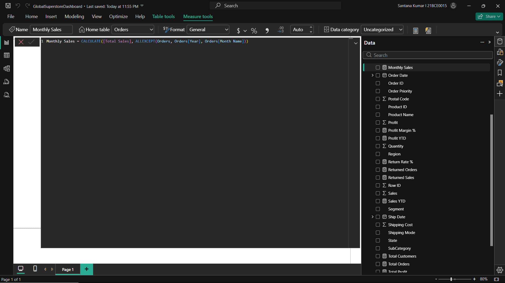
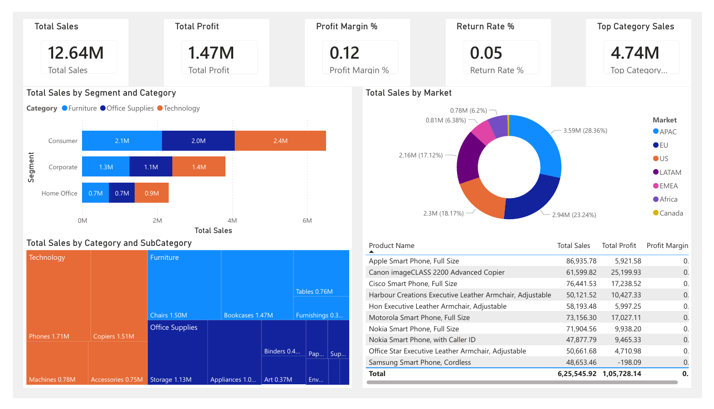
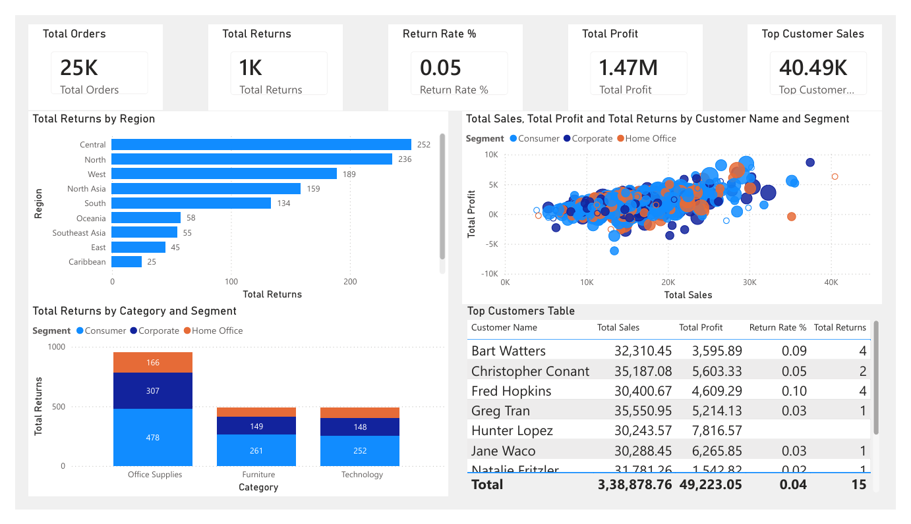
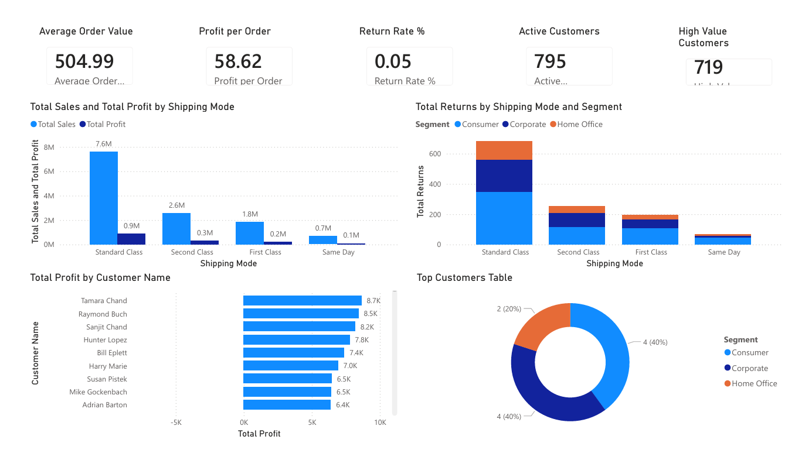
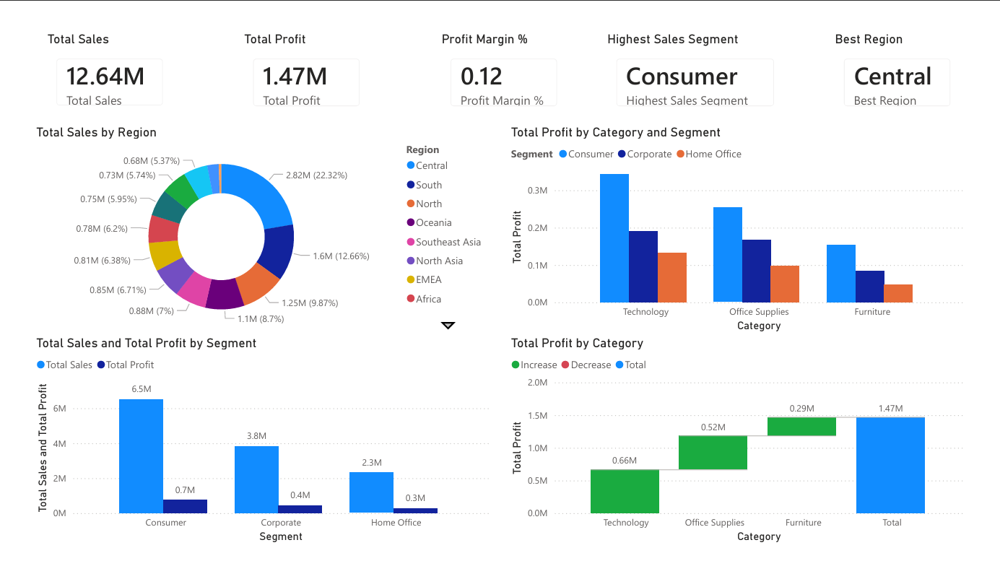

# powerbi-sales-dashboard
Interactive multi-page Power BI dashboard analyzing global retail sales performance, profit trends, customer insights, regional markets, shipping efficiency, and discount impact using the Global Superstore dataset.

## EXECUTIVE SUMMARY
The **Global Superstore Sales Dashboard** is a complete business intelligence portfoliio project developed using **Microsoft Power BI**. The objective of this project is to transform raw retail transaction data into an interactive, executive-ready dashboard that enables effective monitoring of sales performance and profitability.

The dashboard provides key business insights such as:

- Revenue and profit tracking across time periods
- Product category and sub-category performance
- Customer segmentation and top customer analysis
- Regional market contribution and growth patterns
- Shipping efficiency and discount impact on profitability
- Forecasting and trend-based decision support

The project demonstrates practical skills in data cleaning, KPI development using DAX, and professional dashboard storytelling aligned with real-world analytics workflows.

## INTRODUCTION

### Background
Retail and e-commerce organizations generate large volumes of transactional sales data every day across multiple product categories, customer segments, and geographic regions. However, raw datasets are often difficult to interpret directly due to their size and complexity.

Business Intelligence tools such as **Power BI** play a critical role in transforming this data into meaningful dashboards that support:

- Performance monitoring
- Strategic decision-making
- Market and customer understanding
- Profitability optimization

Interactive dashboards allow stakeholders to explore trends, identify high-performing areas, and detect issues in real time.

### Motivation
The motivation behind the project was to simulate a real-world BI analyst workflow by designing a multi-page sales performance dashboard using the Global Superstore dataset.

The project focuses on building an end-to-end reporting solution that not only visualizes sales metrices but also delivers actionable insights related to customer behavior, product profitability, shipping performance, and discount-driven revenue impact.

## PROJECT OBJECTIVES

The main objectives of this Power BI dashboard project are:

- To import and prepare global retail sales transaction data for analysis
- To perform data cleaning and transformation using **Power Query**
- To develop essential business KPIs using **DAX measures**, including:
  - Total Sales
  - Total Profit
  - Profit Margin %
  - Total Orders
  - Average Order Value

- To design a professional multi-stage interactive dashboard covering:
  - Executive sales overview
  - Product and category performance
  - Customer insights and segmentation
  - Regional market analysis
  - Shipping and delivery efficiency
  - Discount and profitability impact
  - Forecasting and trend reporting

- To create a portfolio-ready business intelligence report that reflects industry-standard analytics practices.

## REQUIREMENTS

To run and explore this Power BI dashboard project, the following tools and resources are required:

- **Microsoft Power BI Desktop**
- **Global Superstore Dataset (CSV format)**
- Basic understanding of:
  - Power Query transformations
  - Data modeling concepts
  - DAX measures and KPI creation
  - Dashboard visualization principles

## PROJECT WORKFLOW

The project follows a structured Business Intelligence pipeline similar to real-world analytics reporting processes:

### Phase 1: Data Loading and Preparation
- Imported the Global Superstore dataset into Power BI
- Verified column consistency and corrected data types
- Created time-based fields such as Year and Month for trend analysis

### Phase 2: Data Cleaning and Transformation
- Cleaned raw transactional data using **Power Query Editor**
- Removed blank records and ensured proper formatting
- Standardized numerical and date fields for accurate reporting

### Phase 3: KPI Development using DAX
Developed key analytical measures, including:

- Total Sales
- Total Profit
- Total Orders
- Total Customers
- Profit Margin %
- Average Order Value
- Monthly Sales

These KPIs form the foundation of executive-level reporting.

### Phase 4: Dashboard Design and Visualization
Designed a professional multi-page interactive dashboard containing:

- Executive Overview
- Product Performance Insights
- Returns & Customer Insights
- Customer Base Breakdown
- Executive Insights & Strategic Overview

### Phase 5: Portfolio Documentation
- Captured dashboard output screenshots
- Structured the Github repository with clear folders and scripts
- Documented project workflow and results for recruiter visibility

## RESULTS

### Page 1: Executive Overview

### Page 2: Product Performance Insights

### Page 3: Returns & Customer Insights

### Page 4: Customer Base Breakdown

### Page 5: Executive Insights & Strategic Overview

## KEY INSIGHTS DERIVED

- Technology category contributes highest profit.
- Certain regions drive majority of revenue.
- Some segments have higher return rates.
- Profitability varies significantly by shipping mode.
- A small percentage of customers contribute large revenue.

## KEY SKILLS DEMONSTRATED

The project showcasesthe following core Data Analyst and BI skills:

- Power BI Dashboard Development
- Data Cleaning and Transformation using Power Query
- KPI Engineering using DAX Measures
- Sales and Profitability Reporting
- Customer and Product Performance Analytics
- Regional Market Trend Visualization
- Shipping and Discount Impact Analysis
- Forecasting and Business Trend Interpretation
- Executive-Level Data Storytelling
- Professional GitHub Portfolio Documentation

## CONCLUSION

The project demonstrates an end-to-end Business Intelligence workflow by transforming raw global retail transaction data into a structured, interactive Power BI dashboard.

Through data preparation, KPI development, and multi-page reporting, the dashboard provides actionable insights into sales trends, profitability drivers, customer behavior, regional performance, and operational efficiency.

Overall, the project reflects industry-standard BI practices and highlights how Power BI can be used to support data-driven decision-making in retail and e-commerce business environments.
